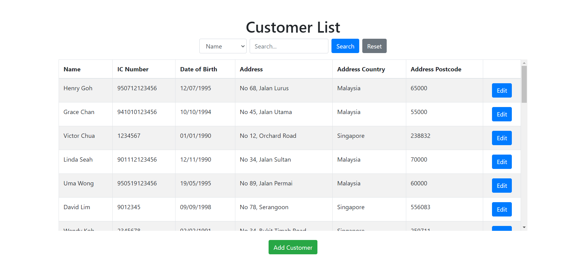
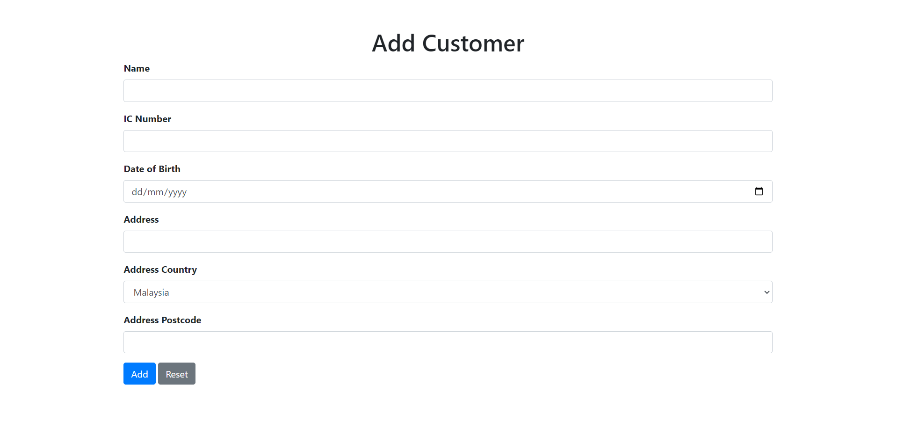
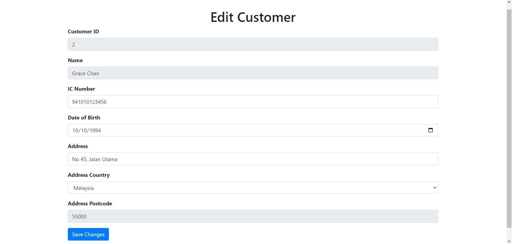

# Sunway Money IT Assessment Part 2

Create a mini project for customer module. This module has included add customer, edit customer information and customer listing. For all the validation need apply in frontend and backend.

### Task Details
- Item 1: Add Customer (Add Button)
- Item 2: Edit Customer (Edit Save Button)
- Item 3: List Customer (This listing can search by Name and IC Number)
- Item 4: Create one user table structure in customerDatabase.sql
- Item 5: Create one Store Procedure (SP) to select all customer information and put this SP in customerDatabase.sql
- Item 6: Create one index for customer table. Explain why you need to apply index for that column.
- Item 7: Create 30 customer records (Insert Query)

You need to create this 5 files and only submit this 5 file for this task.
Frontend File: customerList.html, customerAdd.html, customerEdit.html
Backend File: customer.js (put all API in this file)
Database File: customerDatabase.sql

You can apply
- Frontend: HTML/Bootstrap/Jquery/Javascipt
- Backend: NodeJs (Library Express)
- Database: Any Database

## Project Details
### Screenshots

### Github Repository
[https://github.com/tanxuelee/ModeFair_Assessment_2.git](https://github.com/tanxuelee/customerModule.git)
